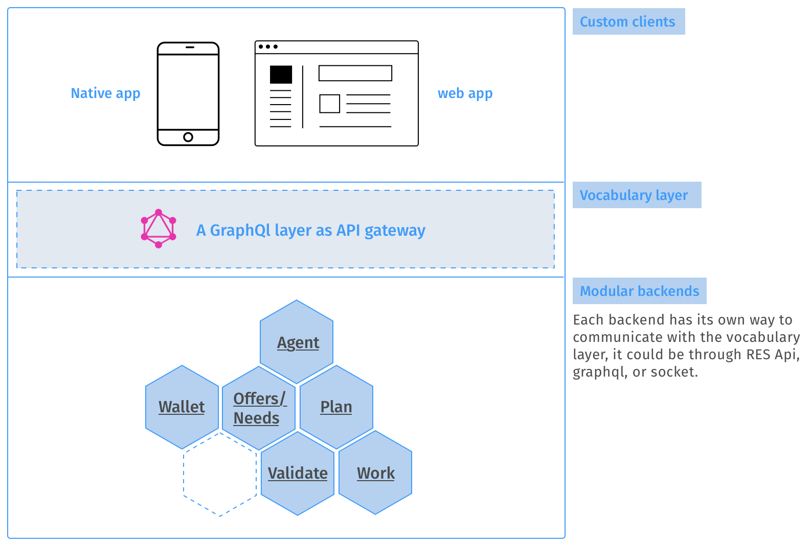

# A minimalistic community framework

Unooverse is an opinionated framework with the goal to fulfils the _**minimum**_ digital needs of a community, gathering together several softwares and make them interoperate with a common vocabulary, giving user access to all the different features from a single app. 

The scope is to facilitate the startup phase of creating and managing a community, letting people focus on internal dynamics and governance, rather than on the research, adoption - understanding and development of digital tools.

**How it works**  
The suite is made of several modules, each module is properly configured to share data with the rest, creating an interconnected ecosystem of tools, that interoperate together according to common patterns and data structures. A community can choose which modules plug - according to its own need.

Unooverse is built with two principles in mind:

* **Minimalism**
* **Interoperability**

**Minimalism**  
A bigger percentage of apps that aim to solve some community needs try to do too much. Often a community uses the same few features present in a software, surrounded by the noise of the other interactions.  
Software included into unooverse, focus on the minimal amount of features that can bootstrap efficiently a community.  
Minimalism is also highly needed, because when a software tries to do too much, it will bind the users to governance rules implemented to tie all the features together \(in the best case\), or for commercial purpose, cultural and ideological background \(in the worst case\).

**Interoperability**  
With the unix philosophy in mind, the suite contains modules that want to solve specific problems: create currencies and managing transactions among members, create a basic internal exchange, plan activities, log work events and so on.  
 Since everything is connected to everything else, any event that happens on a module is visible on the whole ecosystem. A community can even include or create scripts that listen for some actions to automatically perform another event in response.

