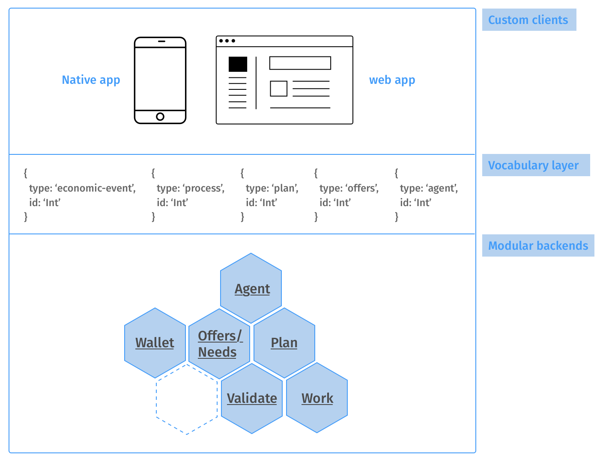

# Tech infrastructure

In the following diagram, we can distinguish 3 levels. 

**Level 1: Custom Clients**

We provide app for iOS and Androind as well as accessible from the browser. New app can be built or customize the existing ones as well.

**Level 2: Vocabulary layer**

It is a set of common data structure to handle basic operations across a community.

It is a way to tied together different backend implementations or new tools added, setting the road about how to format their logic to be part of the app ecosystem.

**Level 3: backends**

Each section has its own backend and database.

